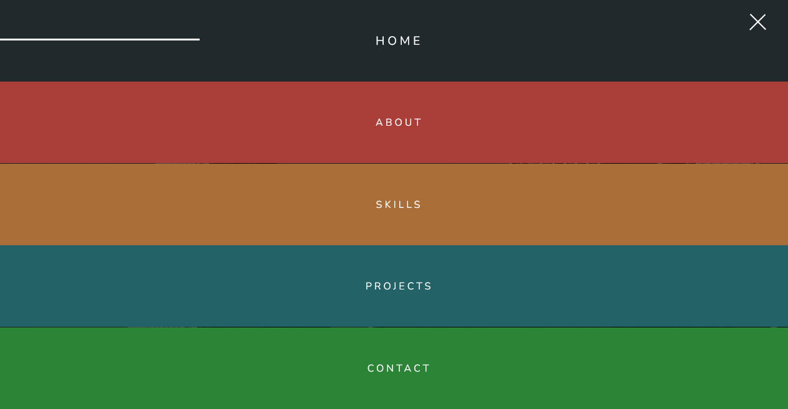

# Animated Hamburger Navigation

This is a small project to build a simple page that have an animated hamburger navigation.

## Table of contents

- [Overview](#overview)
  - [The project](#the-project)
  - [Screenshot](#screenshot)
  - [Links](#links)
- [My process](#my-process)
  - [Built with](#built-with)
  - [What I learned](#what-i-learned)
  - [Useful resources](#useful-resources)
- [Author](#author)

## Overview

### The project

Users should be able to:

- See navigation pane when hamburger icon is clicked
- See slide-in and out navigation item animation when navigation pane is closed or is opened

### Screenshot

#### Mobile preview

#### Desktop preview

### Links

- [Github repo](https://github.com/nurmarief/animated-hamburger-navigation/)
- [Live site](https://nurmarief.github.io/animated-hamburger-navigation/)

## My process

### Built with

- Semantic HTML5 markup
- BEM architecture for CSS
- Mobile-first workflow

### What I Learned

In this project I learn:

1. How to create and animate hamburger icon with css and javascript

2. Create a dynamic slide-in and slide-out delay to be applied in each navigation item with css and javascript

### Useful resources

- [google fonts](https://www.fonts.google.com/)
- [paletton](https://www.paletton.com/)

## Author

- [nurmarief](https://github.com/nurmarief)
